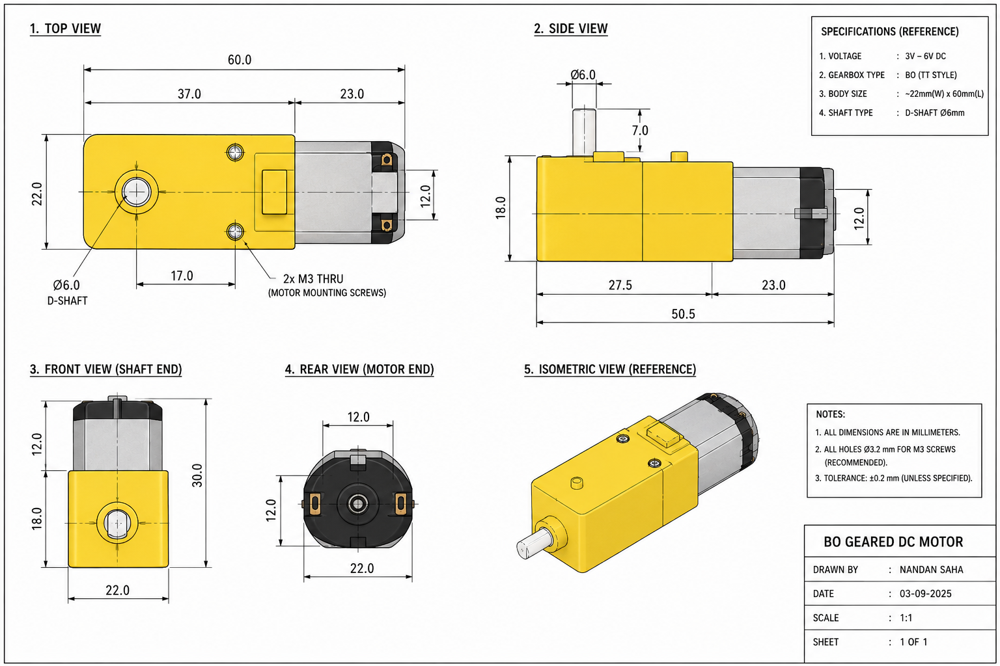

# Motor

## Drawing:

## Description:

| Parameter                       | Specification                            |
| ------------------------------- | ---------------------------------------- |
| **Product**                     | Robocraze Dual Shaft BO Motor with Wheel |
| **Model**                       | R-A-626                                  |
| **Motor Type**                  | DC Geared Motor                          |
| **Shaft Type**                  | Dual Shaft                               |
| **Rated Speed**                 | 100 RPM                                  |
| **Operating Voltage**           | 3–12 V                                   |
| **No-load Current**             | 40–180 mA                                |
| **Torque**                      | 0.8 kg·cm*                               |
| **Motor Dimensions**            | 55 × 48 × 23 mm                          |
| **Shaft Diameter**              | 5.5 mm                                   |
| **Shaft Length**                | 7 mm                                     |
| **Wheel Diameter**              | 65 mm                                    |

## Link

[Link of product](https://robocraze.com/products/dual-shaft-bo-motor-with-wheel-4pcs?variant=40192925008025&country=IN&currency=INR)
